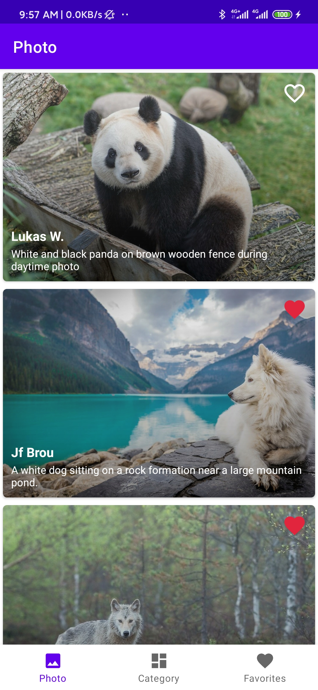
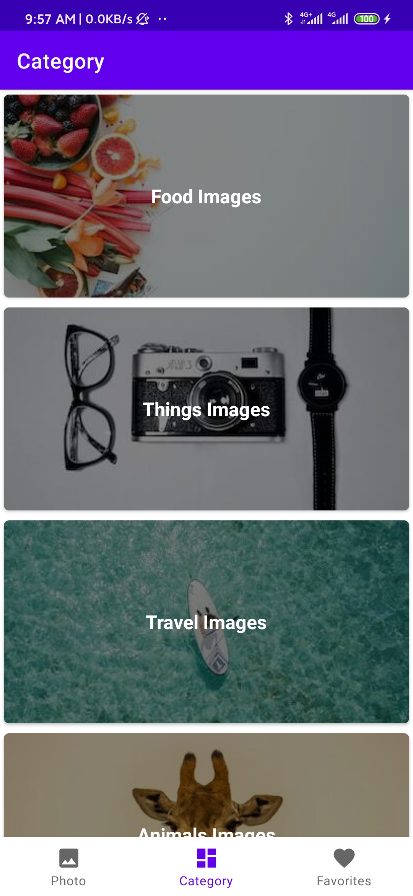
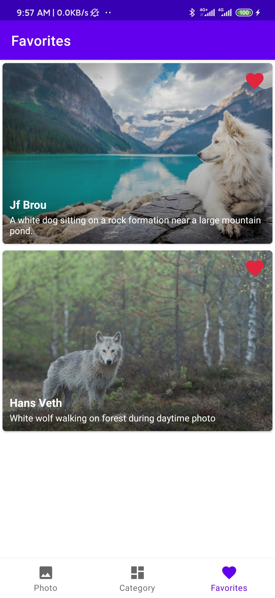
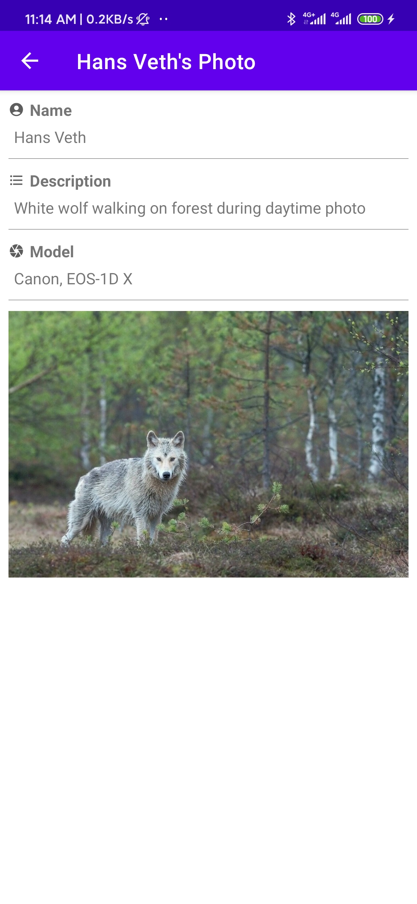
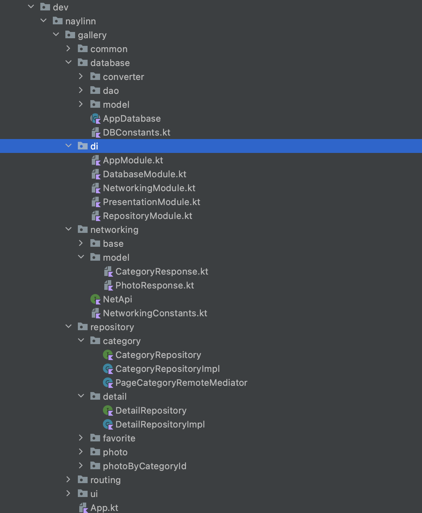
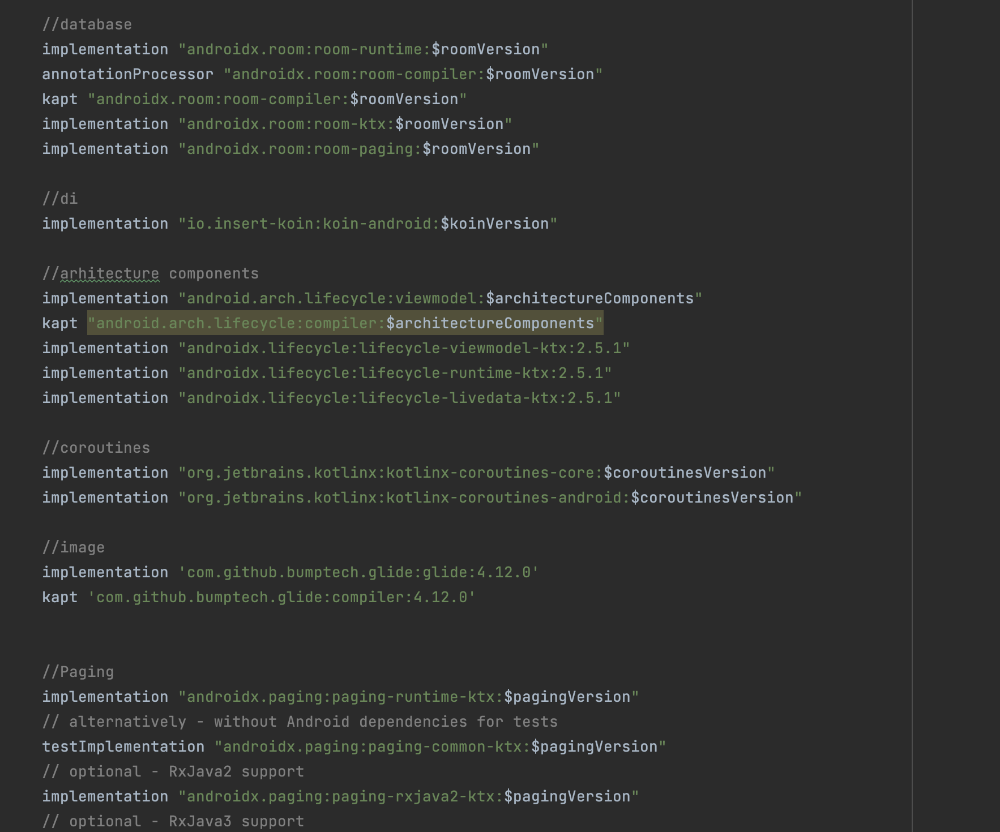

#Gallery Android
I just want to show clean architecture and project structure for android kotlin.

#Screenshot
Photo            |  Category			|  Favorite   |  Detail
:-------------------------:|:-------------------------:|:-------------------------:|:-------------------------:
  |   |   |  

#Third party libraries and where it use
1. Room DB - to store data when grab api from api and show in app UI by using [Paging library](https://developer.android.com/topic/libraries/architecture/paging/v3-overview).
2. Retrofit - HTTP client
3. Koin - dependency injection framework
4. Databinding - [Learn More about Databinding](https://developer.android.com/topic/libraries/data-binding).
5. Viewbinding - [Learn More about Viewbinding](https://developer.android.com/topic/libraries/view-binding).

#Backend Api
I created admin portal and api to implement this project with **Laravel language**

You can check in [https://github.com/naylinndev/Gallery-Backend.git](https://github.com/naylinndev/Gallery-Backend.git).

**If you wanna try demo, you can check in [https://gallery.ntoon.app/](https://gallery.ntoon.app/)**

User Name - **naylinndev@gmail.com**

Password - **Admin**

#Author
Nay Lin - @naylinndev on GitHub

#Folder Structure
Folder Structure            |  Library
:-------------------------:|:-------------------------:
   |  

